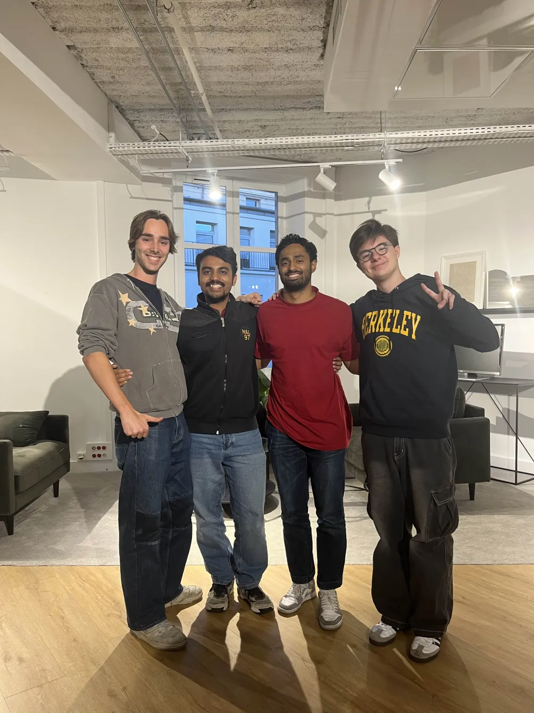

# Neurocrypt

<div align="center">
    
</div>

<br/>

Neurocrypt is a privacy-preserving AI solution developed during the **Privacy Preserving AI Hackathon** in partnership with Entrepreneur First, Hugging Face, and Zama. The project focuses on secure processing of sensitive EEG brain wave data using Fully Homomorphic Encryption (FHE), allowing real-time analysis while maintaining data privacy.

## 🚀 Hackathon Overview

The Privacy Preserving AI Hackathon, held from September 26-28 in Paris, brought together 50 selected participants out of hundreds of applications. Organized by Zama, Hugging Face, and Entrepreneur First, the event aimed to advance privacy-preserving technologies, with a focus on FHE. Participants were challenged to build innovative AI solutions using [Concrete-ML](https://docs.zama.ai/concrete-ml), an open-source library designed for FHE.

## 🧠 The Problem

EEG (Electroencephalography) measures electrical activity in the brain and is used in:

- Seizure detection
- Brain-computer interfaces (BCIs)
- Mental health monitoring

Despite its potential, EEG data poses privacy concerns, and the devices used to measure brain waves are often resource-limited. Neurocrypt addresses this issue by securely processing encrypted EEG data on the cloud without compromising privacy or performance.

## 🔒 The Solution

Neurocrypt's approach involves:

1. **Encrypting EEG data using FHE**: Data collected by wearable devices is encrypted before transmission, ensuring privacy.
2. **Cloud-based encrypted machine learning**: Leveraging FHE on cloud infrastructure to run machine learning models on encrypted data.

This solution allows for accurate and secure real-time analysis, addressing privacy concerns while still providing valuable insights.

## 📊 Dataset

We used the [Seizure EEG Dataset](https://huggingface.co/datasets/JLB-JLB/seizure_eeg_iirFilter_greyscale_224x224_6secWindow) hosted on Hugging Face, featuring:

- **Image size**: 224x224 pixels
- **Total records**: 1,318,793 rows
- **Data windows**: Captured over 6-second intervals across different brain wave frequencies

The dataset supports our efforts in building and validating EEG-based AI models for privacy-preserving applications.

## 📈 Model Performance

### Non-Encrypted Model

- Achieved **85% validation accuracy** for 224x224 resolution images.
- Data was downsampled from **500k to 15k** for optimized training.

### Encrypted Model

- Post-training encryption was implemented using [Concrete-ML](https://docs.zama.ai/concrete-ml), reaching **77% validation accuracy**.
- Encryption and processing were executed within **7 minutes**, showcasing FHE's potential for real-world applications.

## 🎥 Demo

The Neurocrypt demo illustrates the end-to-end workflow, from EEG data encryption on a wearable device to FHE-encrypted machine learning analysis on the cloud.


https://github.com/user-attachments/assets/4f78912f-3376-4b3f-be77-baa3e60f7b7c


## 🏅 Team Members

- Simon Coessens
- Arijit Samal
- Thomas Chardonnens
- Anand-Arnaud Pajaniradjane
- Batu Ergun

<div align="center">
    
</div>

## 📜 License

This project is open-sourced under the [MIT License](LICENSE).

## 🔧 Getting Started

Follow these steps to run Neurocrypt:

1. **Clone the repository**:
   ```bash
   git clone https://github.com/yourusername/neurocrypt.git
   cd neurocrypt
   ```
